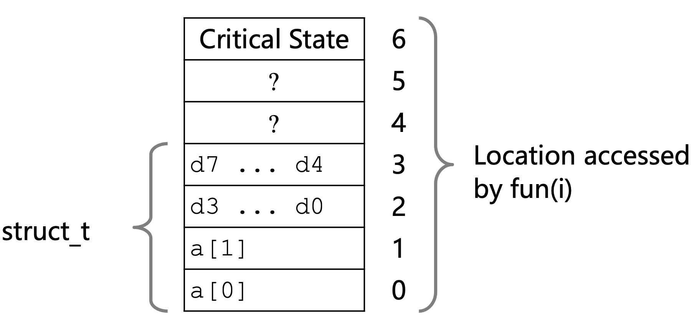

## 摘要
本章主要是全书的一个概览，基本囊括了全书要讲述的所有内容提要，在之后对应的章节中会有相应的详细解释和说明

```C
#include <stdio.h>
int main()
{
    printf("hello, world\n");
    return 0;
}
```
这个简单的C代码将引入本书的内容，包括一些程序创建到在系统上运行，输出信息，终止。
## 1.1 信息就是位➕上下文
这一个源程序hello.c是以字节序列存储在文件中过的，每个字节都有对应的整数(ASCII码)表示
那么也就是说系统中所有的信息——包括磁盘文件、内存中的文件都是由一串比特表示的，用过这些数据对象的上下文来对它们的含义进行区分
## 1.2 程序被其他程序翻译成不同的格式
这里会介绍Linux中是如何将hello.c程序转变为hello可执行文件的
`gcc hello.c -o hello`
其中包含的过程如下

+ 预处理相当于读取头文件 得到.i文件
+ 编译是将hello.i翻译成文本文件hello.s**汇编语言程序**（更低级）
+ 汇编是将hello.s汇编语言翻译成计算机能看懂的**机器指令**，也就是01序列，并且打包为一种可重定位目标程序的格式，保存在hello.o中
+ 链接是链接器ld调用的库函数合并到hello.o中，得到hello可执行文件，可以加载到内存中执行
+ 在OS课程中学到**链接得到的程序中的地址是逻辑地址**，也就是可重定位地址，还需要**装入**
  - 装入分为绝对装入、静态装入、动态装入
  - 绝对装入很少使用，只适合于单道程序环境
  - 静态装入是这个可执行文件加载到内存中就根据偏移等计算出物理地址，且在程序运行期间不能改变
  - 动态装入是这个文件加载到内存时依然是逻辑地址，在运行时才根据CPU中的重定位寄存器计算物理地址，这种方式允许程序在内存中发生移动
  
## 1.3 CPU如何运行程序

在Linux系统中，`linux>./hello`将加载并运行这个可执行文件
这里需要提及系统的硬件组成
1. 总线
贯穿于整个系统的一组电子管道
携带信息字节并在各个部件间传递，通常传递定长的字节块也就是字
<font color="red">机器字长</font>：CPU能一次处理数据的位数，一般与CPU中寄存器位数有关。字长多少位地址也是多少位
总线上信息的传递方式分为**串行**和**并行**
其中分类可以分为

   - 片内总线
   - 系统总线
     + 数据 双向
     + 地址 单向
     + 控制 有出有入
   - 通信总线

2. I/O设备
系统与外界的联系通道，包括磁盘、显示器、鼠标键盘等等
最开始，可执行程序存放在磁盘上
I/O接口是主机与I/O设备之间设置的一个硬件电路及其相应的软件控制
每一台I/O设备都是由I/O接口挂到I/O总线上的，也就是系统到I/O的系统总线
其中I/O总线包括 
   - 数据线     传送数据
   - 设备选择线  选址
   - 命令线     传送命令
   - 状态线     反应设备状态

3. 主存储器
也是通常说的内存
存储器是一个线性的字节数组，每个地址对应一个存储单元
4. 处理器
也就是CPU
核心是一个大小为一个字的存储设备，程序计数器PC，指向下一条应该执行的指令
CPU可能会在指令的要求下执行加载、存储、操作、跳转等任务

下面详细介绍如何运行程序
1. 输入`./hello`命令，就会将命令读如寄存器，再放到内存中


2. shell执行一系列指令从磁盘中加载可执行文件hello到内存中 （这里利用了直接存储器存取DMA，数据直接由外村到达内存而不通过处理器）
   
   - DMA方式
   - DMA和主存之间有一条数据通路，主存和设备交换信息时不通过CPU可以直接交换
   - 另外学过的两种获取I/O数据的方式分别为程序查询方式和程序中断方式，都需要先讲数据送到CPU，再送往内存
   - DMA与主存交换数据的三种方法
     - 停止CPU访问主存
     - 周期挪用
     - DMA和CPU交替访存 
     - [详见链接](https://baike.baidu.com/item/DMA/2385376)
3. 处理器开始执行hello程序并将结果复制到寄存器中，再由寄存器输出到显示器（这里由汇编知识不难理解，I/O指令需要操作寄存器中的内容）


## 1.4 存储设备形成层次结构

由于I/O设备访问内存的优先级高于CPU，并且CPU和内存之间存在速度差异，所以为了避免CPU“空等”，产生了高速缓冲存储器
通常，在有缓存（广义的）的存储器结构中，都是优先访问缓存，若命中，那么就直接得到数据，否则访问下一级，得到数据并将得到的数据写入缓存
*具体会在之后的章节中讲到*
存储器层次结构的的主要思想是上一层的存储器作为低一层存储器的高速缓存


## 1.5 操作系统管理硬件
在程序运行的整个过程中，都没有提到什么部件直接访问底层硬件，相反，它们都依靠操作系统提供服务
操作系统可以理解为应用程序和硬件之间插入的一层软件，所有应用对硬件的操作都必须通过操作系统
操作系统的两个主要功能
+ 防止硬件被失控的硬件程序滥用
+ 向应用程序提供简单一致的机制来控制复杂而又通常大不相同的低级硬件设备
  
操作系统通过几个抽象概念来实现这两个功能
1. 文件即对I/O设备的抽象
2. 虚拟内存即对主存和磁盘I/O设备的抽象
3. 进程即对处理器、主存和I/O设备的抽象表示
4. 当以上内容加上操作系统可以抽象出虚拟机

这些内容在后面的章节中都会详细讲解，这里先简单提两句
- 进程最重要的概念就是进程是活动事体，而程序是被动实体，只有当一个可执行文件加载到内存中才成为进程
- 虚拟内存为每个进程提供了独占的内存空间，每个进程看到的内存都是一致的，每个进程都能占有CPU可寻址的线性地址空间，但实际上是采用了分页存储和请求调页机制来实现
- Linux皆文件，通过将I/O设备视为文件可以更好地管理

## 1.6 Amdahl定律

当对系统的某个部件进行加速时，其对系统整体性能的影响取决于该部分的重要性和加速程度
假设系统某部分所需执行时间与该事件的比例为$\alpha$，而该部分性能提升比例为*k*那么
总的执行时间为
$$T_{new} = (1 - \alpha)T_{old}+(\alpha T_{old}/k)=T_{old}[(1-\alpha)+\alpha/k]$$

那么加速比   $S=T_{old}/T_{new}$

$$S = \frac{1}{(1-\alpha)+\alpha/k}$$
可以看出，要想显著加速整个系统，必须提升全系统中相当大部分的速度

## 1.7 并发与并行

并发，是指多个进程在同个CPU中交替使用，宏观上表现为同时使用，微观上来看还是分时使用
并行，通常是指多个线程在同一CPU中同时运行，真正的同时
多CPU的运行，对应进程的运行状态；多核CPU的运行对应线程的运行状态
进程可以在多个CPU中并行运行，但是同一个CPU中同一时间只能运行一个进程，可以通过并发看起来同时进行
线程可以在多核CPU中并行运行


## 1.8 关于上课的思考和实践

$x^2 \geq 0$对于float始终成立，但是对于int型不一定始终成立——因为int可能会溢出，而int是有符号数，溢出后变为负数

$(x+y)+z=x+(y+z)$ ?

int 和 unsigned来讲是成立的
但是对于float来讲不一定
例如计算
(1e20 + -1e20) + 3.14 -->3.14
1e20 + (-1e20 + 3.14) -->0

由于浮点数frac位数有限，当先计算-1e20+3.14时就把后面的位数丢弃了

**存储引用Bug**
```C
#include<stdio.h>
typedef struct 
{
    int a[2];
    double d;
}struct_t;
double fun(int i){
    volatile struct_t s;
    s.d = 3.14;
    s.a[i] = 1073741824;//Possibly out of bounds
    return s.d;
}
int main()
{
    for (int i = 0;i <= 6;i++)
        printf("fun(%d)->%lf\n",i,fun(i));
    return 0;
}
```
结果是依据特定系统的


原因是地址空间是连续分配的，当访问超出数组a的值之后就会出现异常，不过正好1073741824正好可以拼接起来凑出巧合
但是在访问a[6]就直接错误了，因为那是不能访问的部分区域
