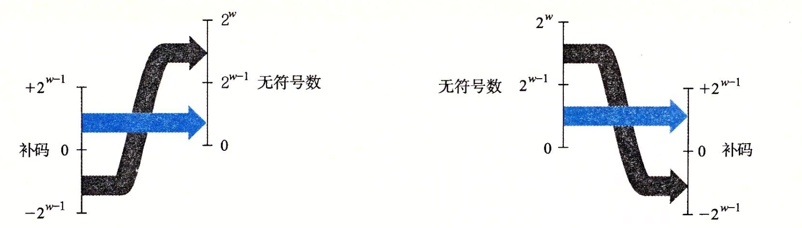
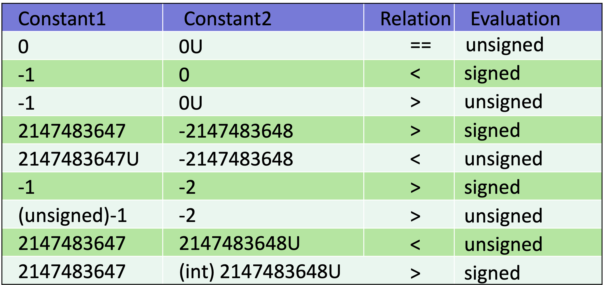
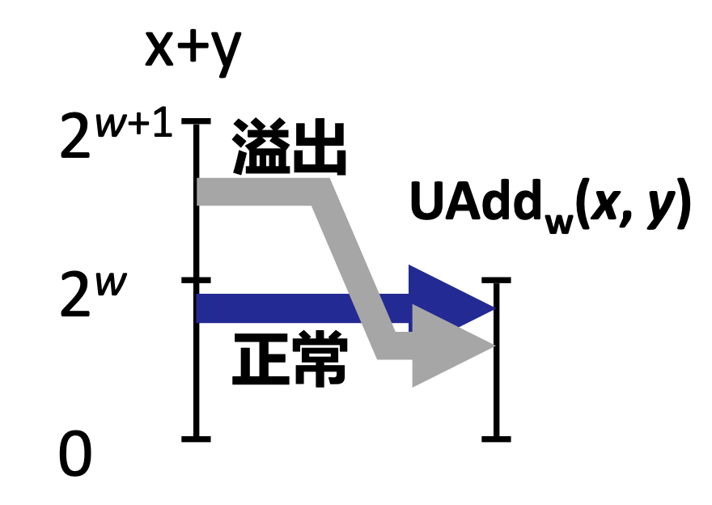
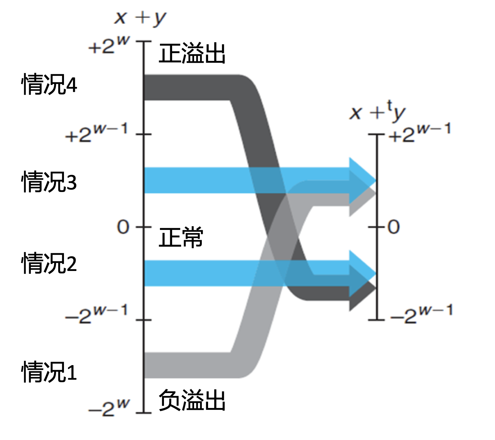
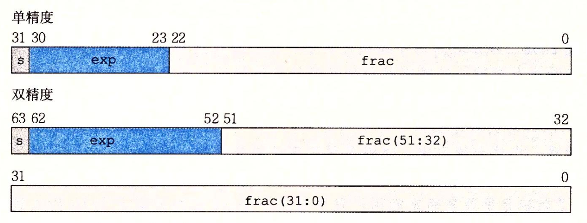
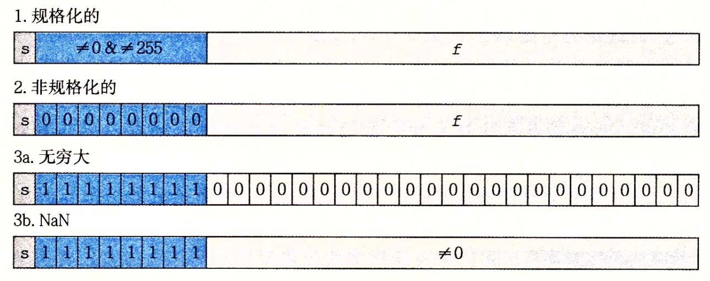
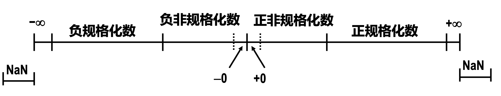
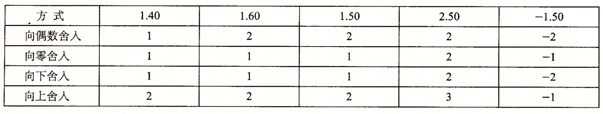

# 信息的表示和处理

本章的重点
1. 整数的表示
2. 整数的扩展和截断
3. 整数的运算
4. 浮点数

## 信息存储
字节作为最小的可寻址的内存单元 机器级程序将内存视为一个非常大的字节数组 即虚拟内存 每个字节都有一个唯一标识的数字 即地址

每台计算机都有一个字长，即指针大小，用来标识虚拟内存大小 即一个机器字长为$w$位的机器而言，虚拟地址范围为0~$2^w$-1，程序最多访问$2^w$字节

### 寻址和字节顺序
字节顺序有两种
1. 大端
   低字节在高地址，高字节在低地址
2. 小端
    低字节在低地址，高字节在高地址
    现在的机器中Linux32、64 以及Windows都是小端机器；Sun是大端机器

### C语言
位级运算
`~` 注意将这个数的**所有位**全部反转
`^`、 `&` 、`|` 注意将两个数的**所有位**异或、与、或得到新的值
逻辑运算
以上的位级运算得到的结果是32bit/64bit 根据数据类型决定
逻辑运算`!` `&&` `||`得到的就是一位，0或1
`!!num`常用来判断num是否为0，并得到一个单独的数位
移位运算
C语言左移就是用0填充
右移如果是有符号数那么用符号位填充，无符号数则相当于逻辑右移

## 整数表示

无符号数$\vec{x}$写成二进制[$x_{w-1},x_{w-2}, ... ,x_{0}$]
那么 其表示的数为$B2U_{w}(\vec{x})=\sum_{i=0}^{w-1}x_{i}2^{i}$
$U_{max}=2^{w}-1$
有多少位表示最大值就是2的多少次方减1
表示范围为0~$2^{w}-1$

有符号数$\vec{x}$使用补码表示，最高位为符号位
$B2T_w(\vec{x})=-x_{w-1}2^{w-1}+\sum_{i=0}^{w-2}x_{i}2^{i}$
相当于最高位取负数再加后面的
$T_{min}=-2^{w-1}$也就是 1000...000
$T_{max}=2^{w-1}-1$也就是 0111...111
因为有一位表示符号位，所以有多少位表示T，最大就是2的w-1次方再减1，最小就是2的w-1次方
-1 表示为 111...111
$T_{min}$没有与之对应的正数
观察得知
$|T_{min}| = |T_{max}+1|$ 非对称
$U_{max}=2*T_{max}+1$

### 有符号数和无符号数之间的转换
强制类型转换不会改变数字本身，但是其表达的含义会发生变化 也就是位模式不变，但是表示的数值可能会变
函数U2T是无符号转到有符号 函数T2U是有符号转到无符号

记忆公式相对繁琐，总结起来就是以下一句话
> $0\leq x \leq T_{max}$的转换数值不变T2U(x)=x,U2T(x)=x
> 在这个范围之外的转换需要加上或者减去$2^{w}$

### C语言中有符号数和无符号数
C语言将常量数字默认为有符号数
无符号数需要用后缀U显式表示
<font color="red">当执行运算时，如果两个操作数中既有有符号数又有无符号数，那么C语言会隐式地将有符号数强转为无符号数来运算</font>


在实际C语言编程中一定要注意隐含的转换规则，否则不要用无符号数
```C
unsigned i;
for (i = cnt-1;i >= 0;i--) 
    a[i] += a[i+1]; i是无符号数，不可能小于0，所有会死循环
```

```C
#define DELTA sizeof(int) //sizeof返回无符号数
int i;
for(i = CNT;i-DELTA>=0;i-=DELTA) //隐式转换为无符号运算，死循环
...
```
当需要进行模运算的时候就用无符号数，当二进制位表示集合时，就用无符号数

### 扩展
无符号数零扩展；有符号数符号扩展
从短整数类型到长整数类型转换时，C自动进行符号扩展

### 截断
无符号数截断 将x对$2^k$取模，只要最后的k位
有符号数截断类似，只不过截断后的数按照补码进行解读

## 整数运算
### 无符号加法
w位的两个无符号数相加 真实和应该是w+1位，丢弃进位保留w位
$s=UAdd_{w}=(x+y)\ mod2^w=\begin{cases}
x+y & x+y\leq 2^w \\
x+y-2^w & x+y\geq 2^w \\
\end{cases}$



TAdd和UAdd有着完全相同的位级表现，只是计算完成后最后结果的解读不相同
w位的两个有符号数相加 真实和应该是w+1位，丢弃进位保留w位，再将剩余w位表示有符号数来解读
$s=TAdd_{w}=\begin{cases}
x+y-2^{w} & T_{max} \leq x+y & 正溢出\\
x+y & T_{min}\leq x+y\leq T_{max} & 正常\\
x+y+2^w & x+y\leq T_{min} & 负溢出\\
\end{cases}$
只有符号位相同，结果符号位变了的情况才会出现溢出，溢出分为正溢出和负溢出，正溢出是两个整数相加得到负数，负溢出是两个负数相加得到正数


之后还有整数乘除，暂不做详述

## 浮点数
### IEEE表示浮点数
浮点表示涉及非常大的数字和非常接近0的数字，目前所有的计算机都采用IEEE754标准
IEEE浮点标准用$V=(-1)^s\times M \times 2^E$的形式表示一个数
s表示符号
尾数M是一个二进制小数frac，范围是1～2-$\epsilon$或者0～1-$\epsilon$
阶码exp
IEEE754对浮点数有两种表示
单精度和双精度


<center>单精度 1  ｜ 8  ｜ 23</center>
<center>双精度 1  ｜ 11 ｜ 52</center>




规格化数 
exp不全为0也不全为1 偏置为$2^{k-1}-1$ 真正的阶码需要在exp的基础上减去偏置，单精度为127，双精度为1023
尾数隐含先导数值1，则真实的尾数为`1.xxx`，xxx为frac的数值
非规格化数
exp为全0，真实的阶码为-126/-1022
尾数没有前导码，就是`0.xxx`
特殊值
exp全1 
当frac全0时表示INF无穷
当frac不是全0时表示NaN，不是一个数




可以看到数值在趋近于0时变密集

### 舍入

IEEE定义了四种舍入方式

后三种比较简单
第一种也是常用的向偶数舍入简单理解为“**四舍六入五向偶**”
如果遇到了二进制比如
$xx100.._2$舍入位置<100..直接舍弃，>100..直接进一，刚好等于100...考虑使舍入结果为偶数

### 浮点运算
IEEE定义了一些特殊操作，比如1/-0得到$-\infty$ 
1/+0得到$+\infty$
浮点加法满足交换，但不满足结合
比如第一章提到过的(1e20 + -1e20) + 3.14和1e20 + (-1e20 + 3.14)
浮点乘法也同样只满足交换不满足结合
浮点数的乘法与整数类似 当$M\geq2$将M右移一位E加1，当E超出范围时则溢出，同时将多出的M舍入，以符合小数部分的精度要求

浮点数的加法需要先对齐阶码，再相加尾数，同样地操作执行移位和舍入

### C语言中的浮点数
C语言中常有两种浮点数数据类型
+ float  单精度
+ double 双精度
在int,float,double之间完成类型转换中会改变位模式
1. int -> float
    由于float尾数只有23位，而int32位所以可能会舍入
2. int/float -> double
    由于int/float位宽 $\leq$ 53bit所以可以精确转换
3. double -> float
    可能会发生舍入
4. double/float ->int
    - 截掉小数部分向0舍入
    - 当数值溢出或NaN无定义时通常设置为$T_{min}$

    