# 程序的机器级表示

## 历史
课上讲述了大量8086的历史，已经在汇编课程汇中详细学习过，并且不是这门课的重点这里不再赘述
之后讲到了IA32处理器体系结构
需要掌握的是出现了32位寄存器EAX,EBX,ECX,EDX等等,较8086的8位的寄存器AL和16位寄存器AX等有所扩展
## 程序编码
在第一节我们说到了程序是如何转化为可执行代码的，而可执行代码就是机器代码，是计算机能够识别并产生相应操作的代码

程序员可视的状态包括
1. 程序计数器（PC）表示下一条指令在内存中的地址
2. 寄存器文件
3. 条件码寄存器
4. 内存（可按字节寻址的数组、程序和数据、栈）
    - 程序内存用虚拟内存来寻址，在任意给定的时刻，只有有限的一部分虚拟地址是有效的，目前只有48位有效，高16位必须置为0
  
gcc的一些参数设置

| 参数 | 效果 |
| :---: | :---: |
| -o  | 生成可执行文件|
| -c  |  只编译不链接|
| -S  | 生成汇编文件.s|
| -E  | 仅执行编译预处理|
| -wall | 显示警告信息 |

书上还讲了一些反汇编的知识，这里不再细说，感觉不会是考试的重点
此书是ATT格式的汇编代码，和Intel格式的汇编代码有所不同，不过基本就是后缀和参数顺序的不同，逻辑都是没差的

## 数据格式
这里需要注意，由于是由16位系统扩展而来的，提到的字都是16位的，32位称为双字，64位成为四字（quad words）
具体x86_64下的数据格式大小如下
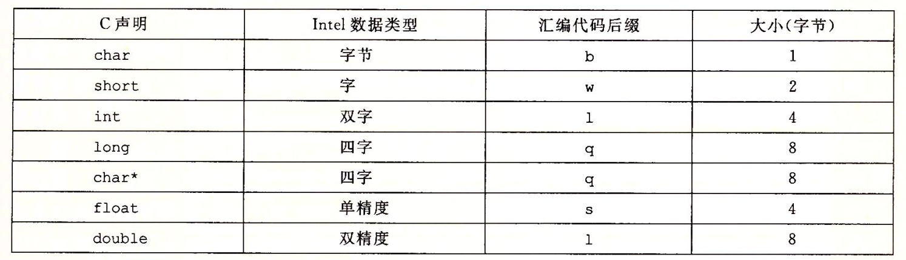
需要注意的是不管指针指向什么类型，指针大小都是8字节
下面是个非常重要的知识点，x86_64的寄存器含义及大小
%al -> %ax -> %eax -> %rax
所有16个寄存器的低位部分都可以作为字节、字、双字、和四字来访问
字节级操作可以访问最低的字节、16位操作可以访问最低的两个字节、32位操作可以访问最低的四个字节（双字）、64位操作可以访问整个完整的64位寄存器
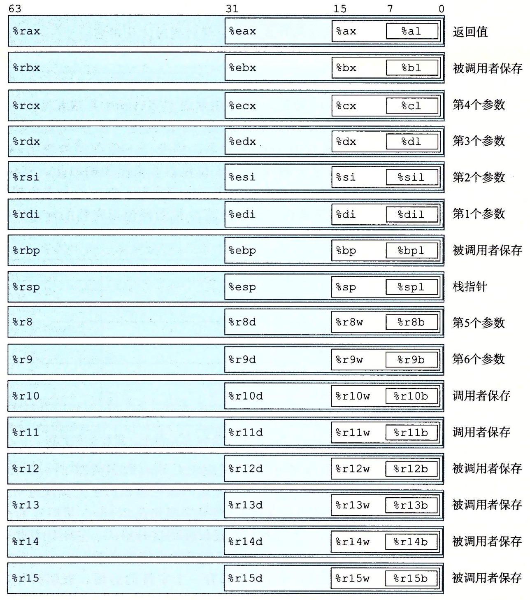
## 访问信息
### 操作数指示符
操作数被分为三种类型
1. 立即数 `$num`
2. 寄存器操作数 表示某个寄存器中的内容
3. 内存引用 根据计算出来的有效地址访问内存中指定位置得到的值，这里有多种寻址模式`(寄存器)`就是以寄存器中的值作为地址去内存中找值，凡是有()都是内存访问
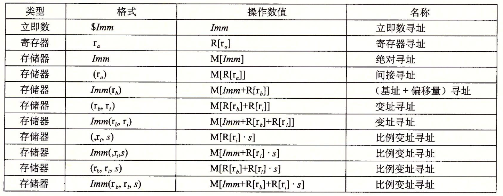
### 数据传送指令
x86_64的传送指令的两个操作数不能同时都是指向内存位置的，另外需要注意的是mov指令中是前一个传送到后一个，与intel不同
这一部分比较复杂，主要涉及指令的后缀
由于源和目的类型不同，把许多不同的指令划分为指令类，每一类中的指令执行相同的操作，只不过操作数大小不同
1. 最简单的数据传送指令MOV类 把数据从源位置复制到目的位置，且**不做任何变化**
   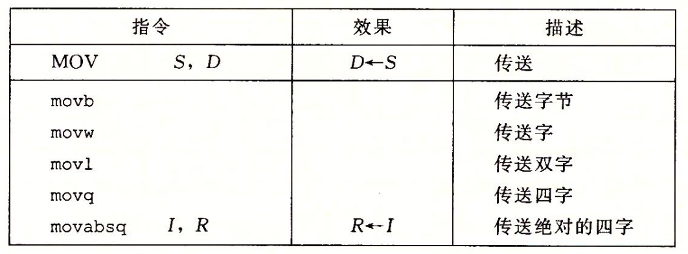
    一般情况下MOV指令只会更新目的操作数指定的那些字节，其余不变；唯一的例外是movl指令以寄存器为目的时会把寄存器的高4字节置为0
    > 为什么会有movabsq指令：因为处理64位立即数时常规的mov指令只能处理32位立即数

   movl比movq快，并且可以直接将前4字节置零，适用于无符号或者正数的立即数传送指令

2. MOVZ类指令
   将较小的源操作数复制到较大的目的时使用
   MOVZ类中的指令把目的中剩余的字节填充为0
  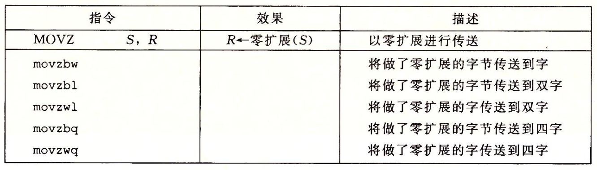 
3. MOVS类指令
   将较小的源操作数复制到较大的目的时使用
   MOVZ类中的指令把目的中剩余的字节按符号填充
   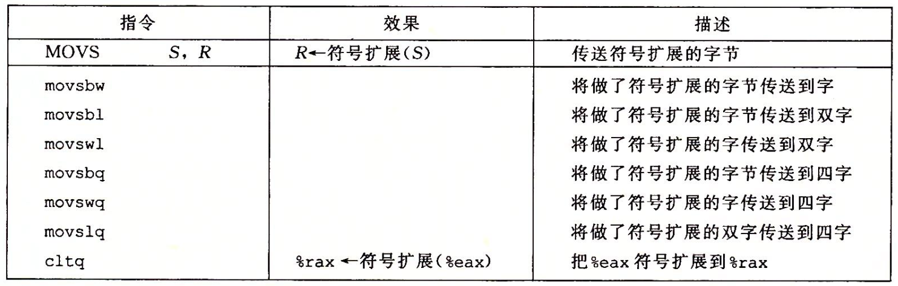
规定：如果强制类型转换既涉及大小变化又涉及符号变化，操作应先改变大小

该部分最后还要提一下栈
push操作把数据压入栈，栈顶指针减少；pop操作删除数据，栈顶指针增加
总是在栈顶插入和删除元素
在x86_64中程序栈存放在内存中的某个区域，向下增长，那么栈顶元素就是所有栈中元素最低的 并且寄存器%rsp保存着栈顶元素的地址
**入栈出栈操作涉及的都是四字**
由于栈和程序代码以及其他形式的程序数据都是放在同一内存中，所以程序可以用标准的内存寻址方式访问栈内的任意位置

## 算术和逻辑操作

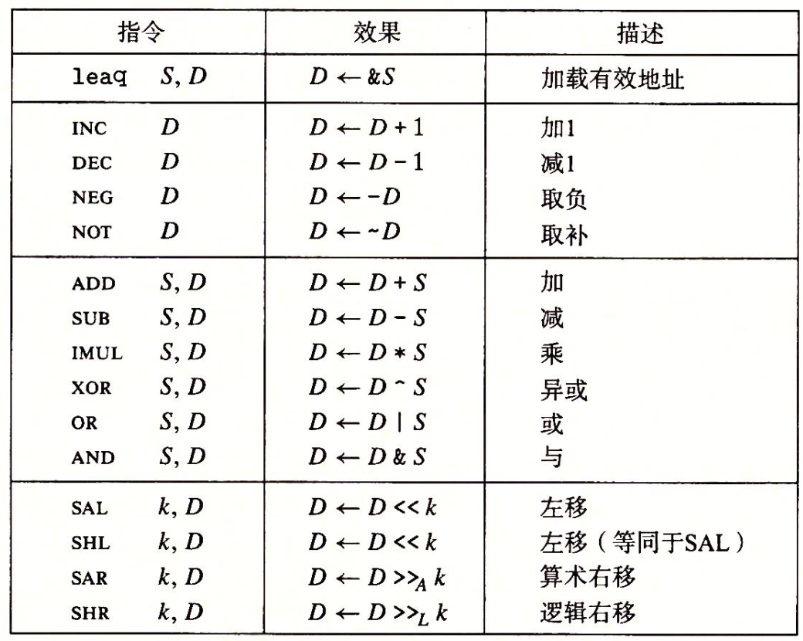

其中leaq(加载有效地址)实际上是movq指令的变形
将内存指定位置的有效地址存入寄存器中，但实际上并没有从内存中读取数据，只是简单地完成了线性计算，于是编译器可以通过leaq有效的执行计算
> leaq原理
> leaq (%rdi,%rsi,4),%rax
> 简单地理解就是(%rdi,%rsi,4)计算内存地址，%rdi + 4*%rsi,然后leaq直接将其值传送给%rax

二元算数操作都是后面的作为目的操作数，相当于进行了 `op=`
> 比如 addq %rdx,%rax <=> %rax += %rdx

之后是移位操作
左移操作中SAL和SHL都是一样的效果，右边填0
右移操作中SAR执行算术移位，填上符号位，SHR执行逻辑移位，填0

最后是乘除操作
乘法包括无符号乘法(mulq)和有符号乘法(imulq)
乘法指令都要求一个参数必须在%rax中，另一个参数作为指令的源操作数给出
计算出的结果存放在寄存器%rdx(高64位)和%rax(低64位)中
除法包括无符号除法(divq)和有符号除法(idivq)
通常是%rdx和%rax保存被除数的高64位和低64位，除数由指令源操作数给出，计算结果商保存在%rax中，余数保存在%rdx中
当除法溢出的时候，所有算数标志状态都不确定

## 控制
这一部分的所有内容都是重点
### 条件码
CPU中除了整数寄存器还有一组单个位的条件码寄存器，常用的条件码有：
CF：进位标志 用于无符号数的溢出检测
OF：溢出标志 用于有符号数的溢出检测
SF：符号标志 
ZF：零标志 最近的操作得出的结果为0
除了leaq不会改变条件码以外算术逻辑运算都会改变条件码
这里需要提出一种在跳转指令中经常使用的指令CMP类和TEST类
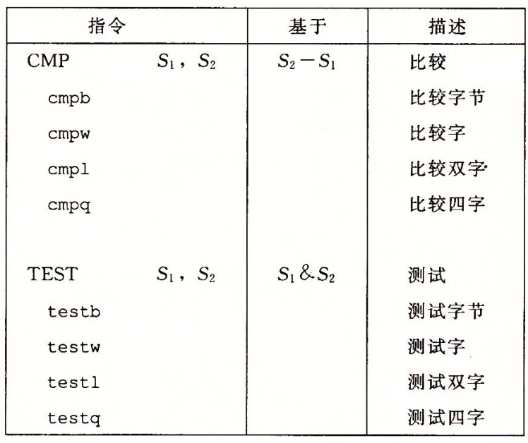
**这些指令不修改任何寄存器的值，只设置条件码**
注意的是CMP也是后面减前面，TEST是两个相与

条件码不会直接读取，而有些指令可以访问
1. 根据条件码的某种组合，将一个字节设置为0或1   set
2. 可以条件跳转到程序的某个其他部分 jXX
3. 有条件地传送数据

接下来依次介绍
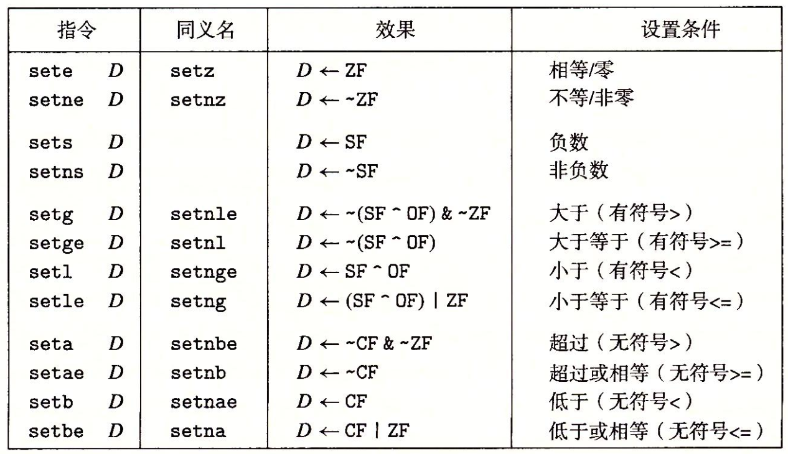
SET指令的后缀是判断某个条件码而不是看字节数

跳转指令 
jmp 无条件跳转 
jXX 有条件跳转
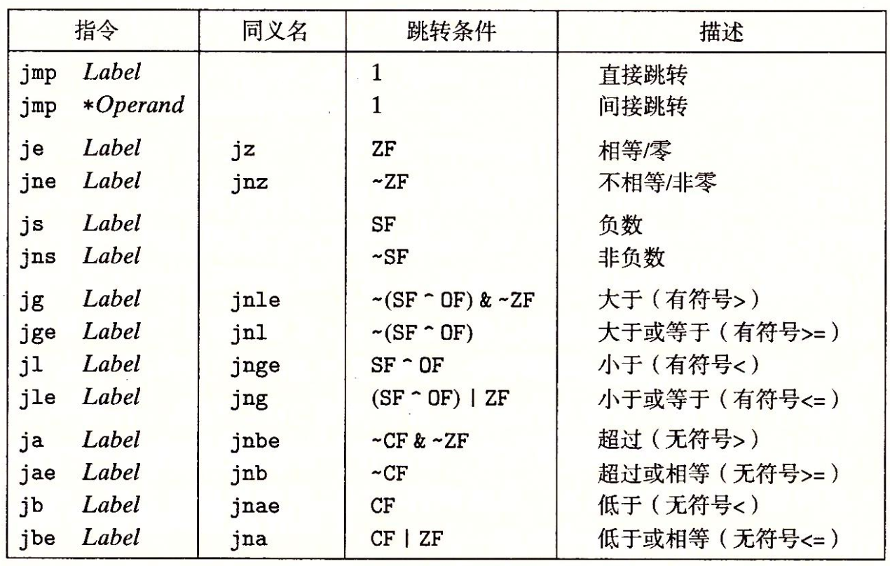
同样，后缀是判断某个条件码而不是字节
无符号用ja，jb；有符号用jg，jl

条件传送指令
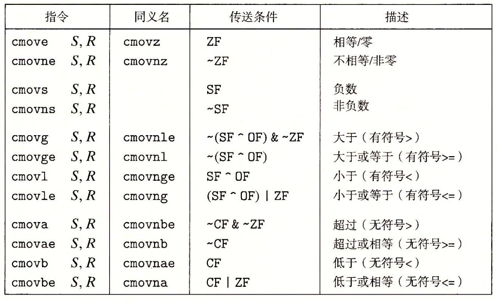
不支持单字节传送，根据目的寄存器的名字推断出传送指令的操作数长度

在使用PC相对寻址时，即jmp之后的地址是相对于PC的相对地址而不是绝对地址时，此时的PC应该是当前执行指令的下一条而不是现在这条，再加上相对地址得到跳转的地址 （其实与PC本身的含义是一致的，不过不太好理解）

### 实现条件分支

#### 用条件控制来实现条件分支
采用goto类语句
将C语言中
```C
if (*test-expr*)
   *then-statement*
else
   *else-statement*
```
转化为汇编中的
```S
   t = *test-expr*;
   if(!t)
      goto false;
   *then-statement*
   goto done;
false:
   *else-statement*
done:
```

#### 用条件传送实现条件分支

由于现代处理器中流水线机制对于预测失效的损失较大，所以考虑这种条件传送来实现条件分支
方法：计算一个条件操作的两种结果，然后根据条件是否满足从中选取一个
即将汇编代码变形为
```
v = *then-expr*;
ve = *else-expr*;
t = *test-expr*;
if(!t) v = ve;
```
**注意 只有在受限情况中此策略才可行**
比如在必须先判断某个分支能否进行的情况下不能使用，另外在分支计算量很大的时候也不能使用，相当于没有减少处罚

### 循环
C语言中有多种循环结构 `do-while` `while` `for`，汇编通过**条件测试**和**跳转组合**来实现循环的效果
do-while循环  翻译成如下的条件和goto
```C
loop: 
   *body-statement*
   t = *test-expr*;
   if(t)
      goto loop;
```
while循环有两种翻译方式
1. jump to middle
   执行一个无条件跳转到循环结尾处的测试，再进行循环
   ```C
      goto test;
   loop:
      *body-statement*
   test:
      t = *test-expr*;
      if(t)
         goto loop;
   ```
2. guarded-do
   首先用条件分支判断再决定是否循环
   ```C
   t = *test-expr*
   if(!t)
      goto done;
   loop:
      *body-statement*
      t = *test-expr*;
      if(t)
         goto loop;
   done:
   ```

for循环和while循环类似，不再赘述

### switch语句
switch语句的特性
当一个case匹配时会执行之后的所有语句，直到break 所以会出现多case，下穿，缺失case现象

使用switch语句会产生跳转表更加高效（跳转表由编译器自动生成），即一个数组，表项i是一个代码段的地址，当程序的开关索引值等于i时程序执行相应动作
使用跳转表的优点是执行开关语句的时间与开关情况的数量无关

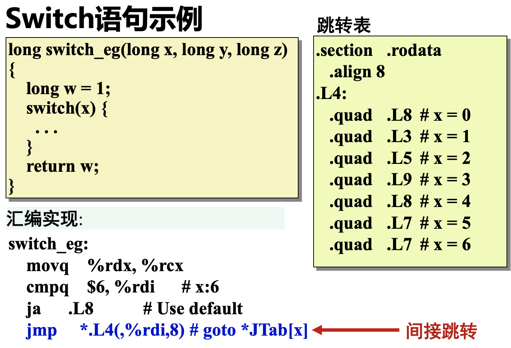
基地址由.L4给出，再根据索引找出目标地址，**每个目标需要8字节**
在汇编代码第二行先设置6为case最大值，大于6的话那么直接default，否则查表跳转

如果有下穿的情况，并且两/多种使用同一变量中途改变了，编译器会自动处理，在指定case开始时再重新对变量初始化
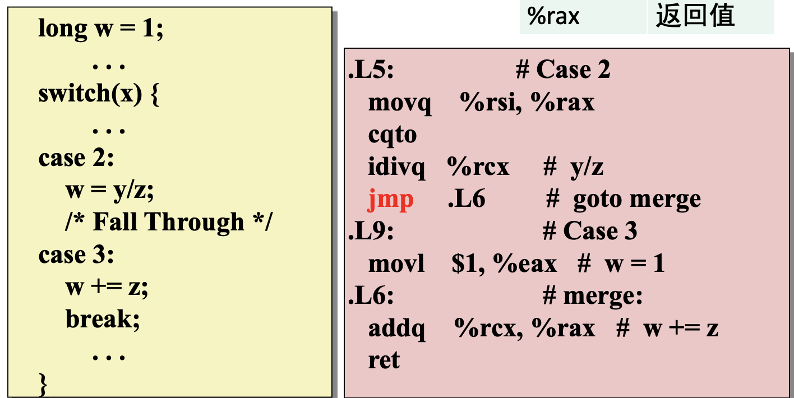
如图所示，当x为2时会有下穿，改变了w之后直接跳到L6执行，而当x为3时，先执行L9重新对w赋值再执行L6操作，这些都是编译器自动实现的


## 过程

假设过程P调用过程Q，Q执行后返回到P，这个动作需要包括
- 传递控制 
   调用Q时，程序计数器设置为Q的起始地址
   返回P时程序计数器设置为Q后面的那条指令的地址
- 传递数据
   P能够向Q提供一个或多个参数，Q能够向P返回一个值
- 分配和释放内存
  过程运行期间为局部变量分配空间，返回时释放这些空间

这三个部分会在之后分别详细介绍
这里提几个预备知识
过程的局部变量都是分配在栈中（如必要），**栈和程序寄存器**保存着传递控制、数据和分配内存所需要的信息
栈在内存空间中是从高到低生长的，同时也遵循LIFO原则，通过将%rsp栈顶指针减少（8的倍数）即可往栈中添加元素
pushq popq  都必须操作寄存器（因为栈本身也是内存中的，不能同时操作内存）
popq时只是将指针加8，那个值还是在那里 
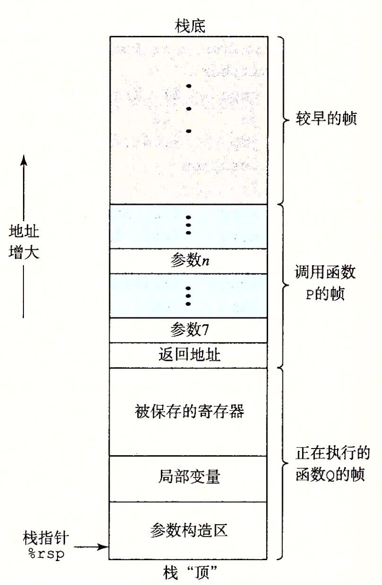
当过程所需的存储空间超出寄存器能够存放的大小时，就需要在栈上分配空间，即栈帧。
<font color="red">注意此图中P调用Q时，P的返回地址是在P的栈帧中的</font>

实际上，许多函数根本不需要栈帧，当所有的局部变量都可以保存在寄存器中时，并且该函数不会调用任何其他函数时就可以不需要栈帧。（对标后文）

思考一个问题 %rbp作为栈基地址是非必需的，既然非必需那么又怎样确定一个过程的栈帧大小呢？
> %rsp是确定的，而编译器在产生汇编的时候就会直接预判所需的栈帧大小，而分配栈帧的本质就是通过改变%rsp的位置，所以在分配的时候%rsp减多少，就是栈帧大小

### 传递控制

理解了C语言中函数调用和返回就行
call func 将返回地址（**call指令的下一条指令地址**）入栈push %rip变为func中的首地址
ret pop弹出返回地址，%rip变为返回地址

### 传递数据

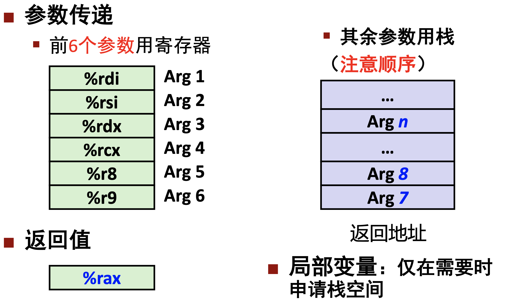
通过寄存器，过程调用时P最多传递6个整数，如果还需要更多则**P需要在栈帧中保存相应参数再调用Q**
将参数1-6的值放到对应寄存器中，将参数7-n放到栈上，参数7是置于栈顶，见上图“栈帧结构”

### 管理局部数据
#### 栈上的局部存储

什么情况会将局部数据存放在内存中
+ 寄存器不足够存放所有本地的数据
+ 对一个局部变量使用地址运算符‘&’，因此必须为其产生一个地址
+ 某些局部变量是数组或结构，必须放到内存中
通常分配这些空间都是在栈上完成的
   
#### 寄存器中的局部存储空间
寄存器被所有过程共享
为了保证当一个过程调用另一个过程时，被调用者不会覆盖调用者会使用的寄存器值需要遵循以下惯例
寄存器%rbx,%rbp,%r12~%r15划分为**被调用者保存寄存器**，P调用Q时，Q必须保存这些寄存器的值，保证在Q返回到P时与调用前是一样的

寄存器%rax,%rdi,%rsi,%rdx,%rcx,%r8,%r9,%r10,%r11都是**调用者保存的寄存器**，过程P在这些个寄存器中存有局部数据，调用Q之前P必须先将它们保存
*通过压栈来保存*

### 递归
递归无需特殊处理，栈帧意味着每个过程调用在栈上私有的存储（保存的寄存器，局部变量，保存的返回地址）

## 数据

### 数组

数组是在内存中连续分配的字节

> 指针数组：每个元素都是指针的数组 比如char *arr[4] 由于`[]`优先级高于`*`，首先是数组，然后是指针
> 数组指针：数组的指针 首先这个变量是一个指针，其次，”数组”修饰这个指针，意思是说这个指针存放着一个数组的首地址，比如 char (*pa)[4] 和 char pa[4]一样

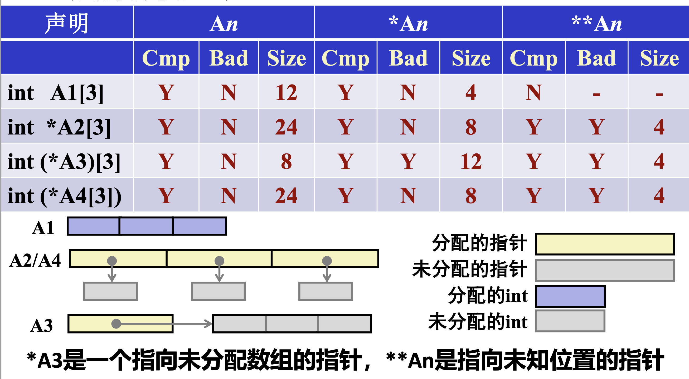

指针的运算
指针的运算需要根据指针指向的类型进行伸缩，E指向int数组，xe是数组的首地址
| 表达式 | 值 |
| :---: | :---: |
| E | xe |
| E+i-1 | xe+4*i-4 |
| `*`(E+i-3) | M[xe+4*i-12] |

这里介绍两种二维数组
1. 嵌套数组
   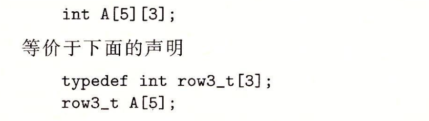   
   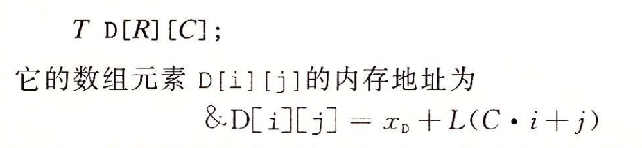
2. 多层次数组
   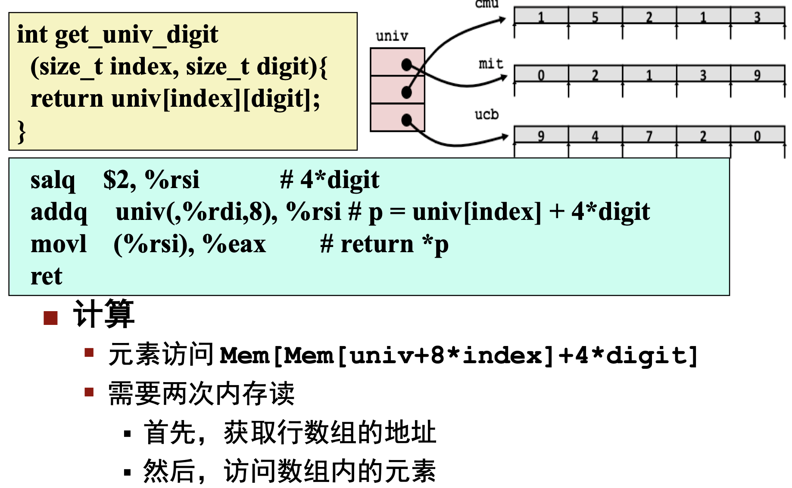

虽然二者计算地址方式相似，但是由于多层次数组中先访问指针再去找数组，所以需要访存两次，嵌套数组直接访存一次即可

### 结构体
结构体的所有组成部分都存放在内存中一段连续的区域内，指向结构体的指针就是结构的第一个字节的地址
字段顺序必须与声明顺序一致
结构体部分只需要掌握**对齐**
结构体中定义的每个数据类型所占字节数为k，其中最大的字节数是K
1. 总的结构体所占内存大小需要是K的整数倍 如果不足需在末尾补至K的整数倍
2. 每一个变量地址起始都必须是自身k的整数倍 如果不是的话需要在之前补上直到自己开始的地址是k的整数倍

<font color="red">注意，涉及指针都是8字节</font>

### 联合体
一个联合体的总大小等于最大字段的大小

## 内存相关

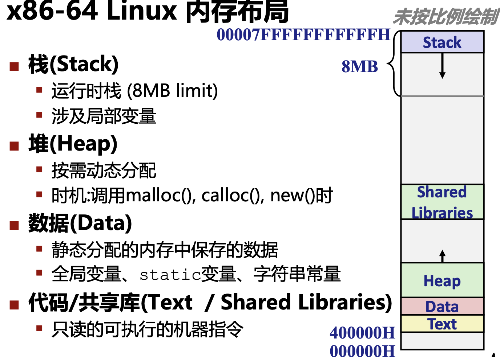
由地址空间可以看出实际只有47位地址有效

这里需要注意的是C语言不会明确对越界访问做出程序崩溃等举动，而且局部变量和状态信息都存放在栈中，对越界的数组元素进行写操作会破坏存储在栈中的状态信息，甚至改变返回地址，产生严重错误
关于缓冲区溢出，总的来讲就是以下问题


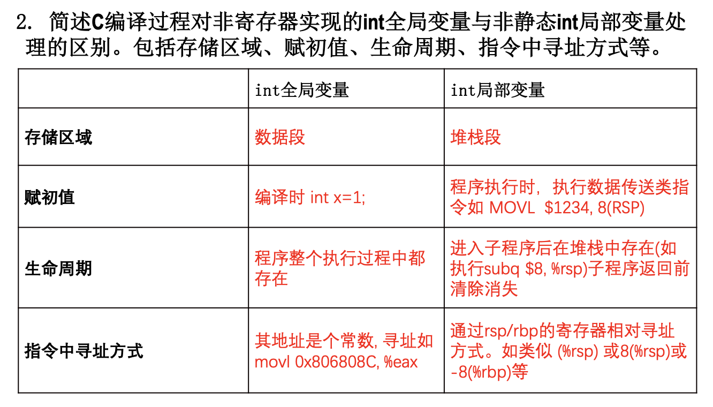


最后浮点代码部分仅作了解，这里不再介绍

*ppt37和书164页返回地址应该是call了之后才有的*