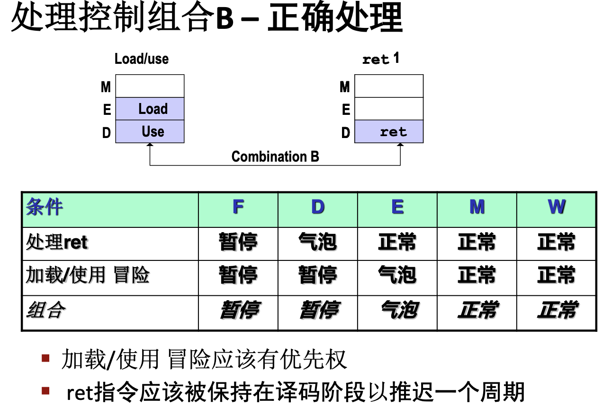

# 处理器体系结构
## Y86-64指令集

1. Y86-64有15个寄存器 (除了 %r15)，每个64位。其中特别注意，0xF代表无寄存器。对于仅使用一个寄存器的指令，使用0xF填充空余位置来表示
2. 三个条件码CC：ZF，SF，OF
3. 程序计数器PC，存放当前正在执行指令的地址
4. 内存：按字节编址的存储序列，小端字节顺序存储
5. 程序状态Stat：表明程序执行的总体状态，指示是正常操作或一些错误状态

Y86-64指令集之包括8字节整数操作，但是没有带比例因子的寻址模式
❌ (%rdi,%rax,8)

本章重中之重

Y86-64指令集的指令长1或2或9或10字节
可以看到根据第一字节Y86-64将指令划分为了不同种类，每个种类中又可能有不同指令    指令中第一字节分为指令码和功能码

可以看到如果只使用了一个寄存器那么需要将另一个寄存器的位置赋为0xF，如果没有使用寄存器比如call那么可以不要寄存器字段，如果使用了两个寄存器那么就需要两个寄存器号了

可以看到将OP类指令分为4条指令add sub and xor
将jXX类指令分为7条指令 jmp，jle，jl，je，jne，jge，jg
注意在跳转指令中不像x86一样可以用相对地址，Y86-64只能使用绝对地址

> 这里有个有意思的地方需要注意
> 前面已经提到过Y86-64小端存储，那么`rmmovq %rsp,0x123456789abcd(%rdx)`的字节编码为多少呢
> 首先前两个字节为0x40和0x42
> 立即数字段高位填充0变为8字节序列位00 01 23 45 67 89 ab cd
> 那么写成小段(低字节低地址)存储的话就是cd ab 89 67 45 23 01 00
> 所以最后指令的编码为4042cdab896745230100

最后介绍一下不常见的指令nop和halt
nop指令：不作任何事
halt指令：停止执行指令
halt、exit和break的区别
halt:退出程序
exit: 退出过程、函数 如果在主程序，则效果和halt一样
break:跳出循环
## 逻辑设计
组合逻辑和时序逻辑的区别
- 组合逻辑—输出仅取决于当前的输入
- 时序逻辑—输出与当前和之前的输入有关(在时钟上升沿来临时才更新输出)

寄存器文件RF
- 写:只在时钟上升沿更新(时序逻辑) 
- 读:类似组合逻辑，根据输入地址产生输出数据(但也有延迟)
  

## Y86-64的顺序实现
### Y86-64顺序执行过程
这一部分描述SEQ顺序处器件，*每个时钟周期上完成完整指令所需的所有步骤*，仅这一部分如此，后面的流水线处理器不是

SEQ各阶段：
+ 取指fetch：
  - 从指令存储器中读取指令icode，ifun，寄存器号
  - 计算valP
  - 读取立即数
+ 译码decode：
  - 根据取指阶段读取到的寄存器号从寄存文件中读取值valA和valB，或者读如%rsp
+ 执行execute：
  - 根据icode和ifun决定valE
  - 设置条件码寄存器CC
+ 访存memory：
  - 将数据写入内存或者从内存中读出数据valM
+ 写会write back：
  - 向寄存器文件中写回
+ 更新PC：
  - 根据指令将PC设置为valP;valC调用指令或跳转指令指定的目标地址；valM从内存中读取的返回地址

由于硬件实现的关系，尽可能使操作有可重用性，所以有些操作虽然逻辑上没必要但是还是如此实现的（比如在执行阶段的加0操作）
由上图中可以看到只有在访存阶段才访问内存M[X]，译码和写回阶段都是寄存器到寄存器

最值得注意的指令是pushq和popq
push先修改指针（ex）再写；
pop先读，再修改指针
call和ret指令和push以及pop相似，都需要操作栈指针%rsp，都涉及压栈出栈，并且这里**valA和valB并没有与rA和rB关联**，甚至没有用到rB还是使用了valB

### SEQ操作

SEQ实现中包括组合逻辑和两种存储器设备：时钟寄存器（程序计数器和条件码寄存器），随机访问存储器（寄存器文件，指令内存和数据内存）
其中程序计数器，条件码寄存器，数据内存，寄存器文件都是都需要在时钟上升沿才能写
SEQ从不回读：处理器不需要为了完成一条指令的执行而去读由该指令更新了的状态
> 这里思考push，要先将栈指针减8才能压栈，但是又不能回读，那么怎么实现呢
> 其实是用了减8计算后的结果valE保存这个地址，作为之后访存的地址M[valE]和写回寄存器%rsp的值R[%rsp]<-valE

*有些指令如跳转指令会读取条件码，但没有指令会既设置条件码又读取条件码*

## Y86-64流水线
### 流水线通用原理
吞吐量：单位时间执行指令的条数
延迟：从头到尾执行一条指令所需的时间
非流水线：
+ 吞吐量=$\frac{1条指令}{该指令执行时间}\times 1000$GIPS
+ 延迟：该指令执行的时间
流水线：
+ 吞吐量=$\frac{1条指令}{各阶段最大延迟}$
+ 延迟：$阶段数\times 各阶段中最大延迟$

通常来讲划分流水线阶段会提高吞吐量，但是由于引入的流水线寄存器延迟会导致整体延迟增加
### Y86-64流水线实现

相较于SEQ处理器将PC的计算挪到取指阶段，并在各个阶段之间加上了流水线寄存器
流水线寄存器只有在时钟上升沿才能写入

对信号进行重新排序和命名
S_Field：流水线相应寄存器
s_Field：流水线S阶段的相关字段的相关值

#### 流水线冒险

最少要用三个nop，如果只用两个nop在%rax写回之前读了，错误；如果只用一个nop读寄存器值都错误；如果不用nop错误
> Y86-64不同于之前学过的RISC-V流水线设计，不具备写回和译码一个时间执行不出错的能力，只能前一个阶段写回后一个阶段译码才不会数据冲突
1. 用暂停来避免数据冒险
  + 使指令停顿在译码阶段
  + 紧随其后的指令阻塞在取指阶段
  + 气泡像一条自动产生的nop指令插入到执行阶段
2. 用转发来避免数据冒险
  + 转发源：e_valE m_valM M_valE W_valM W_valE
  + 转发目的：val_A val_B
  + 将指令生成的值直接从执行阶段或访存阶段或写回阶段送至译码阶段而不需要暂停
    > 注意理解这个转发，和之前RISC-V里的一样，是在同一时刻将数据转发，比如某时刻指令1在M阶段可以将其访存得到的值转发到该时刻指令3的译码阶段，而不是到M阶段可以转发到前面时间的D阶段
  + 当有多个数据冲突时需要对转发进行选择：使用最早的流水线阶段获取的匹配值也就是离该指令最近的那个值
3. 加载/使用数据冒险
  + 一条指令从内存中读取寄存器的值下一条指令马上又以该值为源操作数比如
    mrmovq 0(%rdx),%rax #Load
    adddq %ebx,%eax #Use
  + 必须暂停，也就是将第二条指令阻塞在译码阶段并在下一个周期插入一个气泡然后才能使用转发避免该冒险
  + 不仅mrmovq可能出现加载使用冒险，popq也有可能 
4. 避免控制冒险
   + 控制冒险只会出现在ret指令和跳转指令jxx
   + ret指令只能在译码阶段插入三个气泡
   + 跳转指令在执行阶段才知道是否正确跳转
   + 如果跳转错误，此时jxx指令已经过执行阶段在取出的两条指令的执行阶段和译码阶段插入bubble，由于都没有经过执行阶段所以不会影响状态码

>关于nop和bubble
nop是一条完整的指令，必须从取指阶段开始。bubble一般都是在某条指令取指令以后发现控制冲突或者数据冲突时，处理器判断出，当前已经取指的指令如果进行到执行阶段，就会产生错误结果，因此会让这条错误的指令在bubble之后的各个阶段都执行相当于nop的操作。这样就相当于取消了这条错误指令

总结

Y86-64流水线CPU中的冒险的种类与处理方法
1. 数据冒险:指令使用寄存器R为目的，瞬时之后使用R寄存器为源
处理方法有:
   + 暂停:通过在执行阶段插入气泡(bubble/nop)，使得当前指令执行暂停在译码阶段;
   + 数据转发:增加valM/valE的旁路路径，直接送到译码阶段;
2. 加载使用冒险:指令暂停在取指和译码阶段,在执行阶段插入气泡(bubble/nop)
3. 控制冒险:
   + 分支预测错误:在错误地址target处的两条指令分别在执行和译码阶段插入1个bubble
   + ret:在ret后插入3个bubble

#### 流水线控制逻辑

这一部分对于理清前面讲的内容很有帮助

**加载/使用冒险**
**处理ret**
**预测错误的分支**
**异常**
以上这些特殊控制情况都是通过数据转发和分支预测所不能处理的

> 如果使用了暂停，那么通常会搭配气泡一起使用，暂停使指令停顿在某个阶段，气泡使寄存器状态不变；而如果只使用气泡则不用暂停，还是可以正常取指令，比如ret

重点！

注意，上图是针对流水线寄存器的动作而言，而不是对各阶段的动作而言
这里由于之前解决的ret还是取出了三条无效指令，这里直接采用了暂停
**这个表非常重要**

### 性能分析
通过计算PIPE执行一条指令所需要的平均时钟周期数的估计值来量化处罚对整体性能的影响，称为CPI 每指令周期数
$CPI=\frac{C_i+C_b}{C_i}=1.0+\frac{C_b}{C_I}$
CPI就等于1.0加上一个处罚项，即一条指令平均要插入多少个气泡
$CPI=1.0+lp+mp+rp$lp表示加载使用冒险插入气泡（1）的平均数，mp是预测错误取消指令时插入气泡（2）的平均数，rp是由于ret造成暂停插入气泡（3）的平均数

### 控制组合（了解）
当有上面这种特殊情况需要流水线做出处理的组合时，需要对处理进行综合

当控制组合时，流水线寄存器的操作优先级：暂停 > 气泡 > 正常