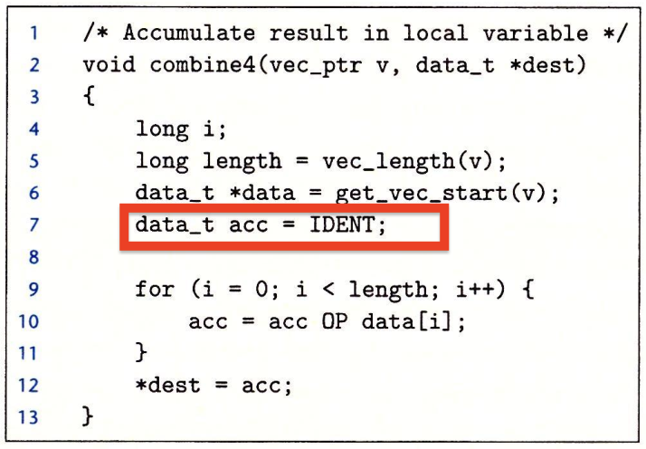
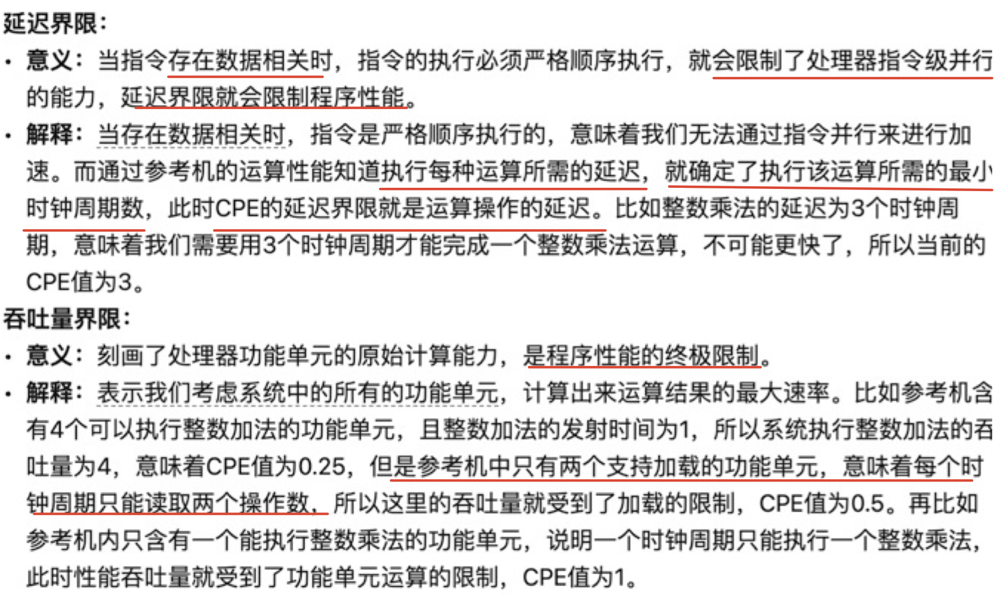
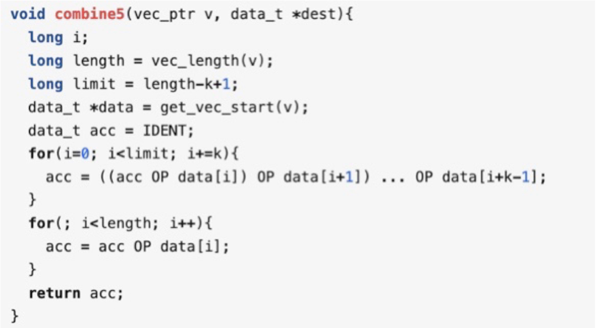

# 优化程序性能
本章主要需要掌握的是如何优化，至于处理器的指令并行原理等不用深究
优化程序性能
+ 选择适当的算法和数据结构
+ 让编译器能够有效优化
  - 编译器优化的局限性
    + 大多数分析只在过程范围内进行
    + 大多数分析都是基于静态信息的
    + 当有疑问时，编译器必须是保守的
  - 总之，编译器的优化总是简易的，保守的，如遇到逻辑问题需要程序员自己决定
+ 编写多线程并行处理

## 普遍有用的优化
+ 代码移动   如将得到相同结果的运算移除循环
+ 用更简单的方法替换昂贵的操作 如用移位和加代替乘除
+ 重用公用子表达式

## 妨碍优化的因素
1. 函数副作用
   
   显然strlen长度不变理应将其移出循环，但由于程序修改了字符串，**编译器必须假设所有情况所以不敢轻易将其移出**
   函数可能修改全局状态。编译器将函数调用视为黑盒，不敢轻易优化
   可以使用inline内联函数，相当于宏定义，将函数展开，进行优化
2. 内存别名使用
    两个不同的内存引用指向相同的位置，编译器将假设不同的指针可能指向相同的位置
    
    如果xp和yp指向同一内存地址那么得到的结果就不同了，所以编译器不会自动优化为程序2
    可以通过局部变量消除这种危害
## 表示程序性能
由于程序不同，循环次数是可变的，所以对于循环程序，用每个元素的周期数来度量速度，关注给定长度、程序运行速度
CPE(Cycles Per Element):每个元素的周期数。表示向量或列表操作的程序性能的方便方式
$T = CPE\times n + 基本开销$
这里会举例子来说明程序优化的方法，重点掌握方法，原理次之

长度是n和一个数组，之后的程序为了计算数组中所有元素的和

之前提到过的，编译器不会对函数进行优化

在循环中每次都调用了查找函数，将其在最开始得到数组的起始，便可以不调用直接索引了

由于使用了指针，可能出现内存别名影响，并且使用指针每次访问都需要访问内存，**采用局部变量**来避免内存别名同时加快访问
以上优化都不依赖于目标机器的任何特性，只是简单地降低了过程调用的开销，以及消除了一些重大的妨碍优化的因素
进一步提高性能必须考虑利用处理器微体系结构的优化
处理器两个特点
+ 超标量： 处理器可以在每个时钟周期执行多个操作——指令级并行
+ 乱序： 指令执行的顺序不一定和机器代码的顺序相同，进一步提高指令级并行

假设执行某种运算的功能单元有k个，发射时间为n，则吞吐量界限为n/k

在之前的基础上，每个循环执行k倍的更有用的工作
注意，在这种循环展开中循环中计算的结合顺序会影响CPE，应该在循环体中计算acc OP (data[i] OP data[i+1]..)这样流水不会产生依赖，提高性能，称为kx1a展开

只有保持能够执行的该操作的功能单元流水线都是满的，程序才能达到这个操作的吞吐量界限（不能超出执行单元的吞吐量限制）

## 分支
当遇到条件分支时，无法确定继续取指的位置，直到分支/整数单元的结果确定后，才能解决
在预测的位置开始执行指令，但不要真修改寄存器或内存数据
编程时提高跳转到预测正确分支的概率