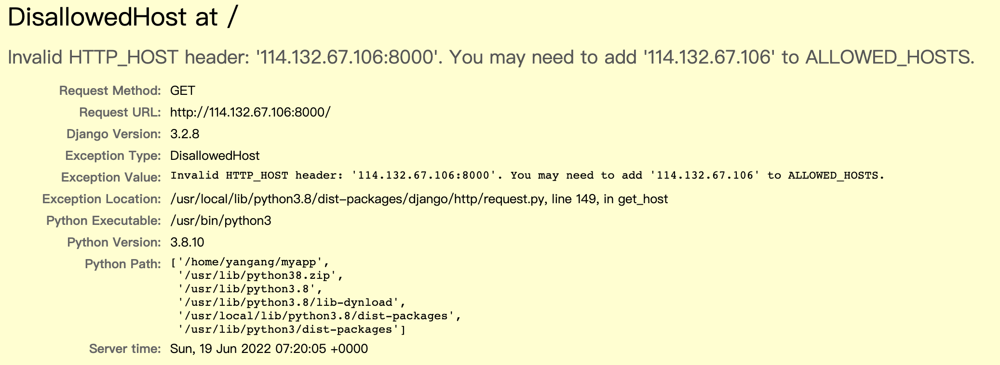

## 摘要
本次记录开始了Django正式，系统的学习
[项目地址](https://github.com/Yg125/acapp)
在vscode中打开远程进行编辑

## 1. 项目创建

`django-admin startproject xxx(myapp)` 创建一个django项目
即可得到如下所示的myapp项目文件
``` bash
myapp/
├── manage.py
└── myapp
    ├── __init__.py
    ├── asgi.py
    ├── settings.py
    ├── urls.py
    └── wsgi.py
```
`manage.py`文件非常重要，django的命令与其有关
> Django's command-line utility for administrative tasks.

命令`python3 manage.py runserver 0.0.0.0:8000` 开启服务，即可打开初始的页面,由于我已经在我的腾讯云中打开了8000端口来对应django，所以可以使用。
如果想另外使用django的项目需要使用别的端口，或者不能同时使用相同端口！
```
Watching for file changes with StatReloader
Performing system checks...

System check identified no issues (0 silenced).

You have 18 unapplied migration(s). Your project may not work properly until you apply the migrations for app(s): admin, auth, contenttypes, sessions.
Run 'python manage.py migrate' to apply them.
June 19, 2022 - 07:19:03
Django version 3.2.8, using settings 'myapp.settings'
Starting development server at http://0.0.0.0:8000/
Quit the server with CONTROL-C.
```
这时会出现以上提示，由于是在服务器上搭建的django所以打开网页时要用服务器的ip地址
输入114.132.67.106:8000即可访问
但此时会出现错误

需要在settings.py中第28行添加ip地址
`ALLOWED_HOSTS = ["114.132.67.106"]`

刷新之后再次打开网页即可出现初始django页面

## 2. django内容创建

### 2.1 创建管理员账户
命令`python3 manage.py startapp xxx(game)`创建game内容
```
game
├── __init__.py
├── admin.py
├── apps.py
├── migrations
│   └── __init__.py
├── models.py
├── tests.py
└── views.py
```
包含了django提供的admin功能，此时需要将数据库的内容migrate同步一下`python3 manage.py migrate`
这样就可以114.132.67.106:8000/admin进入管理员界面了
之后键入`python3 manage.py createsuperuser`创建管理员，即可登录并管理后台

在`settings.py`文件中找到`TIME_ZONE`，修改为`Asia/Shanghai`，可以显示中国时间

### 2.2 创建自己的页面
首先需要在game中新建文件urls.py 和文件夹 templates
game中最重要的就是models.py, views.py, urls.py, templates
models.py -- 存储数据结构（类）
views.py -- 函数（视图）
urls.py -- 网页地址
templates -- html
**注意！！！**
总的urls.py包含所有url信息，添加的网页都需要写到这里
game里的urls.py只是找到在game这个app下的网页内容
1. 在views.py中
    ``` python
    from django.http import HttpResponse #http返回字符串

    def index(request):
        line1 = '<h1 style="text-align: center"> Django project </h1>'
        line2 = ''
        return HttpResponse(line1 + line2)
    ```

2. 在game的urls.py中
    ``` python
    from django.urls import path
    from game.views import index
    urlpatterns = [
        path('', index, name="index"),
    ]
    ```

3. 在总的urls.py中加入新添加的网页
    ``` python
    from django.contrib import admin
    from django.urls import path,include # +

    urlpatterns = [
        path('game/', include('game.urls')), # + 输入114.132.67.106:8000/game即可进入新添加的页面
        path('admin/', admin.site.urls),
    ]
    ```
至此，基础的搭建过程就已经结束